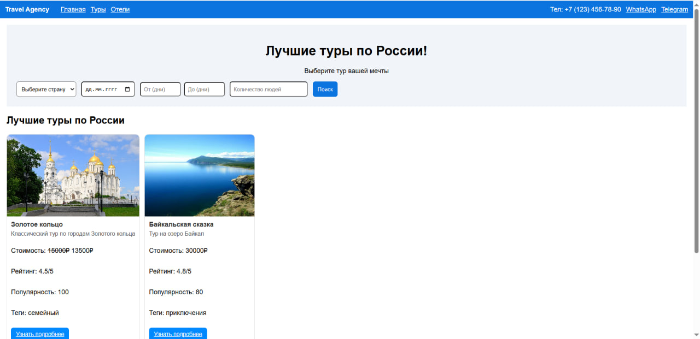
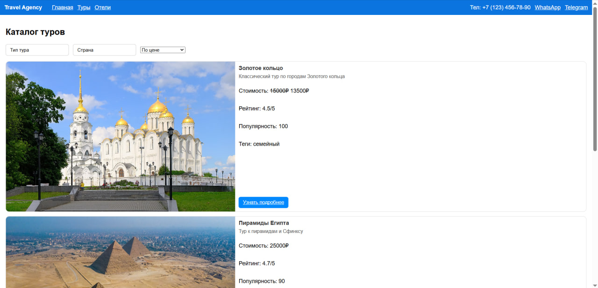
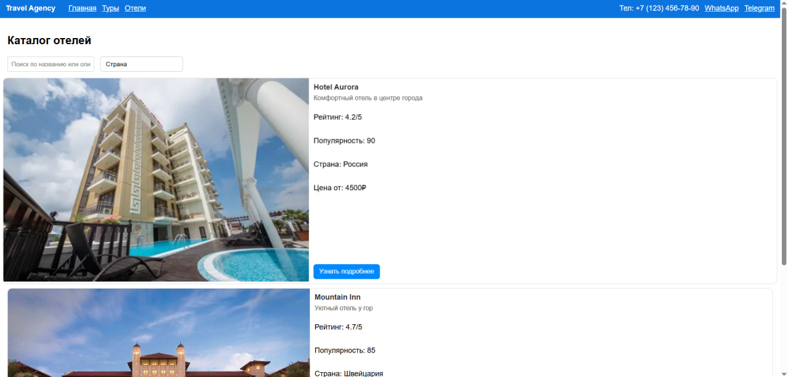

## Описание проекта

Данный репозиторий является выполнением лабораторной работы №5 по предмету JavaScript. Лабораторная работа состоит из двух отдельных проектов:

- **ui-library** — библиотека UI-компонентов
- **client-app** — демонстрационное приложение (frontend), которое показывает работу компонентов в контексте туристического агентства

Компоненты реализованы с использованием **React** и **TypeScript**. В проекте используются собственные компоненты без сторонних UI-библиотек для интерфейса.

## UI-Library

Библиотека UI-компонентов содержит базовые элементы интерфейса, которые используются в клиентском приложении:

- **Button** — универсальная кнопка с поддержкой нескольких вариантов оформления.
- **Card / ProductCard / TourCard** — карточки для отображения отелей и туров с разными вариантами лейаута (фото слева или снизу).
- **Input** — базовый текстовый инпут.
- **PhotoGallery** — компонент фотогалереи.

Компоненты спроектированы так, чтобы:

- принимать данные через `props`,
- корректно отображаться при неполном наборе параметров,
- масштабироваться и адаптироваться под разный контент (тексты, размеры картинок).

## Client-App

Приложение **client-app** демонстрирует использование компонентов из библиотеки **ui-library** в реальном сценарии туристического агентства.

**Основная функциональность:**

- Страница с турами:
  - фильтрация по типу тура и стране через выпадающие списки,
  - сортировка по цене, рейтингу и популярности,
  - карточки туров с краткой информацией и переходом на подробное описание,
  - детальная страница тура с фотогалереей и формой подачи заявки.
- Страница с отелями:
  - поиск по названию и описанию,
  - фильтрация по стране через выпадающий список,
  - карточки отелей (фото слева, цена на карточке),
  - детальная страница отеля с фотогалереей, условиями проживания, отзывами и формой бронирования.
- Форма подачи заявки:
  - поля «Имя» и «Телефон»,
  - валидация имени (одно слово, только буквы),
  - валидация телефона в формате российского номера (`+7**********` или `8**********`),
  - сохранение заявок в `localStorage` (имитация бэкенда).

## Инструкция по запуску

Перед первым запуском установите зависимости в каждом из проектов.

### UI-Library

```bash
cd ui-library
npm install
npm run build
npm run test
npm run test:coverage
npm run lint
```

### Client-App (frontend)

```bash
cd client-app
npm install
npm run build
npm run test
npm run test:coverage
npm run lint
npm run dev
```

После запуска dev-сервера **откройте в браузере**: `http://localhost:5173`

## Тестирование и качество кода

- Для обоих проектов настроены **Jest** и **Testing Library**.
- Для библиотеки **ui-library** покрытие по компоненту `Button` доведено до уровня, достаточного для выполнения требования (около / не ниже 90% по основным метрикам покрытия).
- В корне каждого проекта настроен **ESLint** (файл `eslint.config.ts`) с жёсткими правилами:
  - отступы в 2 пробела,
  - запрет лишних пустых строк,
  - запрет точек с запятой `;`,
  - порядок импортов и дополнительные стилевые ограничения.

## Скриншоты






